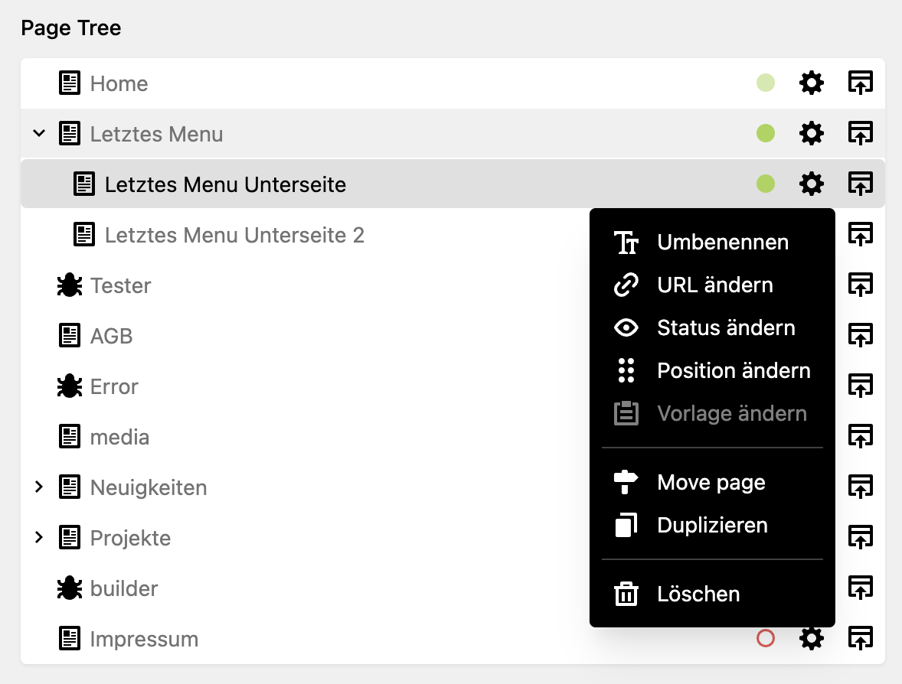
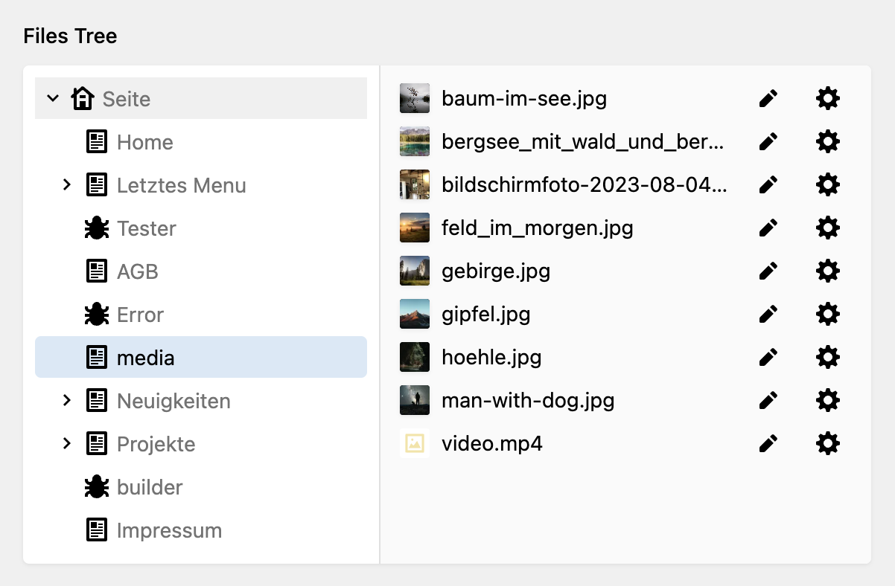

# Kirby 4 Browser Section

## Overview

A section for showing pages/files in a nice tree view (based on components that used in the link field). Direct links to edit and preview items. 

> NOTICE: This plugin intentionally includes a bug based on [this thread](https://github.com/getkirby/kirby/issues/5465). (See index.php Line 5)

> Currently on alpha. Use on your onw risk.

**Todos**
- [ ] Improving permission on PageView.vue (line 35) and on Browser.vue (line 21)
- [ ] Adding Button 'Add'
- [ ] Multiselect
- [ ] Creating field for selecting items
- [ ] Open files in a dialog
- [ ] Move to section pages/files with prop `layout: tree`

## How to use

### Using Section for pages

``` YAML
sections:
  browser:
    label: Page Tree
    type: browser
```



### Using Section for files

``` YAML
section:
  browser:
    label: File Tree
    type: browser
    files: true
```



## License

MIT

> Do you like this Plugin? [Buy me a ☕️](https://www.paypal.com/donate/?hosted_button_id=5W5RBKYXBDABN)